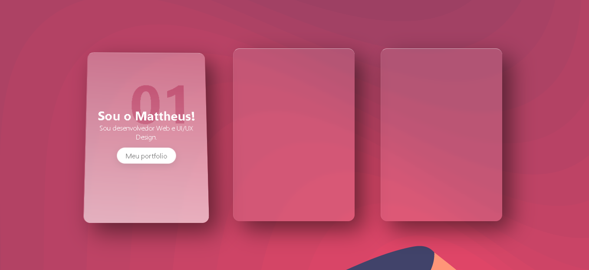

# Criando Animações com Vanilla JavaScript

Este repositório contém exemplos e recursos para ajudar você a criar animações utilizando apenas JavaScript puro (Vanilla). Não são necessárias bibliotecas adicionais, pois utilizaremos as funcionalidades nativas da linguagem.

## Como utilizar

1. Clone este repositório em sua máquina local:

2. Abra o arquivo `index.html` no seu navegador preferido.

3. Explore os exemplos disponíveis e navegue pelo código-fonte para entender como as animações são implementadas.

## Contato ✉️

- E-mail: mattheusp382@gmail.com
- LinkedIn: [Mattheus-Pereira](https://www.linkedin.com/in/mattheuspereira/)
- Instagram - https://www.instagram.com/mattheusp_dev/
- Portfólio: [mattheus-portoflio.com](https://mattheusp-portfolio.vercel.app/?vercelToolbarCode=q89Jf0X1nPzxRLO)

## Licença ⚖️

Este projeto está licenciado sob a Licença MIT(https://opensource.org/licenses/MIT) - consulte o arquivo [LICENSE.md](LICENSE.md) para obter mais detalhes.
